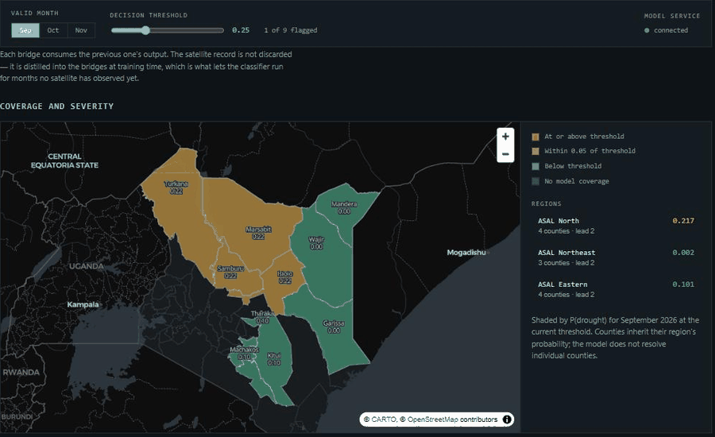
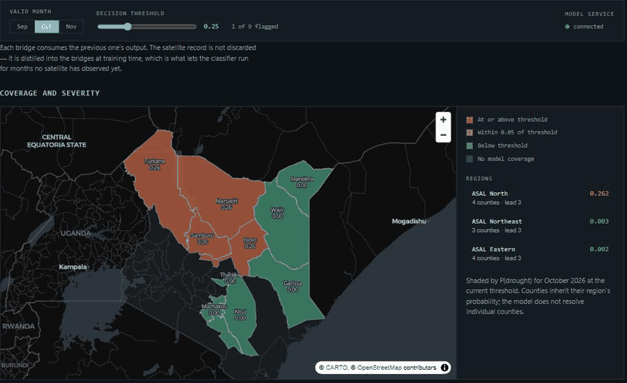

<div align="center">


# Cascade Bridge

**Drought forecasts for months no satellite has seen yet.**

by Nature Cipher · IGAD Hackathon 2026

[Live dashboard](https://naturecipher-drought.pages.dev) · [Methods](docs/METHODS.md) · [Architecture](docs/ARCHITECTURE.md) · [Data schemas](docs/DASHBOARD_SCHEMA.md)

[](LICENSE)

</div>

<table>
<tr>
<td width="33%"><br><sub><b>Scrub the month.</b> October flags ASAL North.</sub></td>
<td width="33%"><br><sub><b>Move the threshold.</b> The decision changes; the forecast does not.</sub></td>
<td width="33%"><br><sub><b>Ask, then publish.</b> Grounded answer, then a PDF bulletin.</sub></td>
</tr>
</table>


---

## The problem in one sentence

You cannot photograph October in July.

Drought early-warning systems run on satellite data — rainfall from CHIRPS,
vegetation greenness from MODIS. Those pictures are excellent, and they only
exist for months that have already happened. So a drought model built on them
tells you what *is* happening, never what *will*.

That gap is where people get hurt. By the time a failed season is visible from
orbit, the livestock are already thin, the water points are already dry, and the
money that could have pre-positioned fodder is three months late.

## What we built

**Four machine-learning models that produce the satellite data before the
satellite can.**

That is the product. Not the dashboard — the models.

We trained XGBoost regressors on 35 years of history to learn what the satellites
*would* see, given only the atmosphere. Feed them a seasonal weather forecast and
they generate the rainfall, greenness and land-temperature layers a drought
classifier needs — for months that have not happened yet.

```
Weather forecast (ECMWF SEAS5, 51 ensemble members, atmosphere only)
        |
        |-- Model 1 --> rainfall          (learned from CHIRPS, 1990-2024)
        |-- Model 2 --> vegetation        (learned from MODIS NDVI)
        |-- Model 3 --> land temperature  (learned from MODIS LST)
        |
        '-- 51 features --> Model 4: drought classifier --> probability
```

Each model feeds the next, in the order the physics runs: rain drives greenness,
greenness moderates ground heat. That chaining is what the name refers to.

**The satellite record is not thrown away — it moves.** From inference time,
where it is impossible, to training time, where it is abundant.

## Why the models are the contribution

The dashboard is a window onto the models. The models are what transfers:

| | |
|---|---|
| **Reusable** | The bridges are independent of the drought classifier. Anything needing rainfall or NDVI at a forecast horizon can use them |
| **Portable** | Trained per region on public data. Nothing about the method is Kenya-specific |
| **Cheap** | CPU inference. A full forecast for eleven counties runs in seconds |
| **Falsifiable** | We publish the baseline that could disprove them. See below |

## We publish the number that could sink us

`python scripts/evaluate_baselines.py` prints three things:

1. **The drought base rate.** 2021–2024 covers the worst Horn of Africa drought in
   forty years. If most months are drought months, a model that always answers
   "drought" scores well while knowing nothing. Without this number, accuracy is
   unreadable.
2. **A majority-class baseline.** The floor any model must clear.
3. **An ERA5-only baseline.** The same classifier *without* the bridges.

The third is the honest test. The bridges are built from the atmospheric inputs,
so they cannot conjure information those inputs did not already contain. If the
cascade does not beat ERA5-only, the contribution is *forecastability* — running
at a lead time where nothing else can — not accuracy. We publish it either way,
because a panel of modellers will run the comparison themselves.

An early-warning system that overstates its confidence is worse than none.

## What the dashboard does

**[naturecipher-drought.pages.dev](https://naturecipher-drought.pages.dev)**


- **Scrub the month** — watch the map change across the three forecast months
- **Drag the decision threshold** — signals appear and disappear. Changing the
  threshold changes the *decision*, never the forecast
- **Hover any county** — probability, region, coverage
- **Ask a question** — an assistant grounded strictly in this issue's data,
  instructed to refuse rather than estimate a number the data does not contain
- **Generate a bulletin** — the situation report a county drought committee would
  circulate, exported to PDF. The model writes the prose; every number in the
  table is rendered from the forecast file, so a mis-stated figure cannot reach
  the data

## Who it is for

| User | Decision it supports |
|---|---|
| County drought committees — Turkana, Marsabit, Samburu, Isiolo, Wajir, Mandera, Garissa, Kitui, Makueni, Machakos, Tharaka-Nithi | Pre-position water trucking and fodder, or hold |
| ICPAC and national met agencies | A forecast layer beside Drought Watch and HUSIKA, which monitor the present |
| Anticipatory-action funds | Release money on a trigger, at a threshold they choose |

The threshold is 0.25, not 0.5. That is a deliberate statement that **missing a
drought costs about three times what a false alarm costs**. A county with
pre-positioned funds can act at 0.15; a treasury releasing a large disbursement
may want 0.40. Same forecast, different risk tolerance, one slider.

## Repository

```
inference/                  the models and the pipeline  <- the product
  cascade_bridge.py           the four chained models
  seas5_adapter.py            weather forecast -> model inputs
  forecast_runner.py          end to end, writes the dashboard payloads
  data_loader.py              model + history storage
scripts/
  evaluate_baselines.py       the number that could disprove us
  build_counties_geojson.py   county boundaries from geoBoundaries
dashboard/                  static site, no build step
functions/api/              chat + bulletin (Cloudflare Pages Functions)
docs/                       methods, architecture, schemas, story
RUNBOOK.md                  how to regenerate every published number
```

## Running it

```bash
pip install -r requirements.txt
cp credentials.env .env                 # models + history live in private S3

python scripts/evaluate_baselines.py    # baselines first
python -m inference.forecast_runner     # writes dashboard/forecast.json
```

Models and processed data sit in a private S3 bucket. Request read-only access
from **kelvin@naturecipherai.com**. Every dataset is public at its original
source — see [`docs/DATA_ACKNOWLEDGMENTS.md`](docs/DATA_ACKNOWLEDGMENTS.md).

## Honest limits

- Forward forecasts are **experimental**. One SEAS5 initialization, not a
  multi-year hindcast
- The January–March 2026 result is a **hindcast** — it used reanalysis available
  after the fact. Not evidence of ahead-of-time skill, and not presented as such
- SEAS5 ships 51 ensemble members; we average them. **Every probability is a
  point estimate with no error bar.** Carrying the spread is the next build
- Soil moisture uses persistence, because SEAS5 does not provide it. Disclosed
  with its justification in [`docs/METHODS.md`](docs/METHODS.md)
- The decision threshold was tuned on the same window the metrics report on
- Eleven counties. The conditions grid is at native ~100 km resolution and is
  deliberately **not** downscaled: there is no per-pixel drought probability,
  because the models were fitted on regional means and no pixel-level ground
  truth exists to validate one

## Stack

Python 3.11 · XGBoost 2.0.3 · xarray + cfgrib · pandas · scipy · boto3 ·
AWS S3/EC2 · MapLibre GL · Cloudflare Pages + Pages Functions · Groq

## Team

**Nature Cipher** — Nairobi, Kenya. NVIDIA Inception · 500 Global Pre-Acceleration.

## Licence

Code MIT. Data belongs to its original providers, cited in full.
